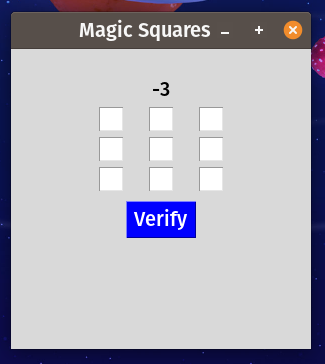

# Magic-Squares
A game of magic squares written in python tkinter on June 2022

# How to play?

So in the text boxes you have to enter such a number that the sum is the number given above in horizontal/diagonal/vertical layout like:-

```                
3(Number)

1 | 1 | 1

1 | 1 | 1

1 | 1 | 1
```

# Preview

